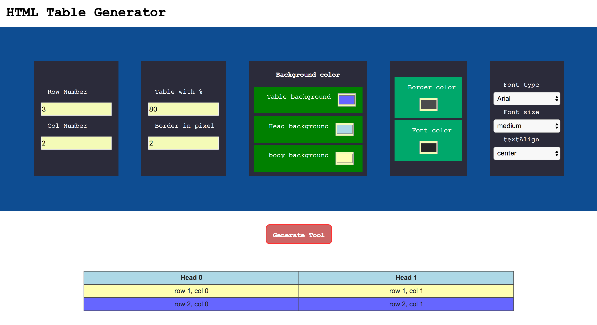

# MTML Table Generator

### 1. Introduction 
Users can create a table dynamically, giving styles.

### 2. Features 

#### 1) Inputs for table style
- Row & Col number
- Table width 
- Border in pixel 
- Background (table, head, body)
- Colors for border and font
- Font style(type, size, text Align)

#### 2 ) Create table
- Click button for generating a table 
- Clean the previous table in each time when they click button
- Creating table with style inputs

### 3. Demo 
